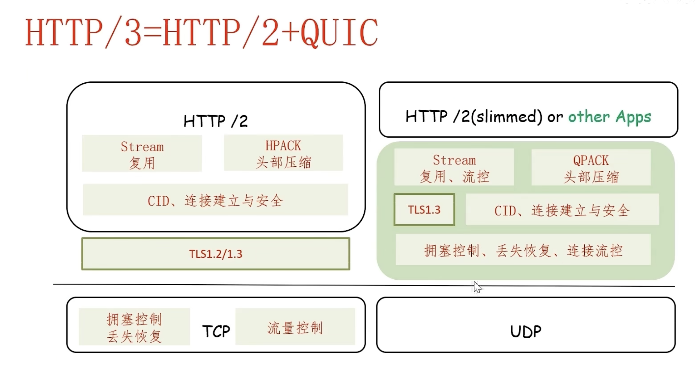

## HTTP1

### HTTP 1.0

每个对象获取的时间为 `2RTT+L/R`

1. RTT: TCP 建立连接
2. RTT: HTTP请求到响应的前几个字节返回
3. L/R: 对象/文件的传输时间

n个对象获取的时间为 `n*(2RTT + L/R)`

::: info 并发请求

HTTP 1.0 多个并行连接的意思是同一时间发出多个请求，会极大增加服务器负担，同时要开很多TCP连接。服务端通常限制对客户端的并发连接数，并发请求也会消耗客户端资源。

:::

### HTTP 1.1 持久连接

#### 非流水线方式

少了一个RTT，减少了后续建立连接的时间，同时在请求的对象只有一个

n个对象共花费: `RTT + n * (RTT + L/R) = (n + 1) * RTT + n * L/R`

#### 流水线方式

**HTTP流水线** （英语：HTTP pipelining）是将多个**HTTP**请求（request）整批提交的技术，而在发送过程中不需先等待服务器的回应。

n个对象共花费: `(2RTT + L/R) + RTT + (n - 1)L/R = 3RTT + n * L/R`

第一个对象获取时间 `RTT + L/R`

::: warning 问题

- 服务器按序响应(FCFS)
- 小对象不得不等大对象传输完才能传输(HOC传输)，影响用户体验
- 丢失恢复(重传丢失的TCP段)时实际上暂停了对象传输, 增加了延迟

:::

## HTTP2

### 减少多个对象HTTP请求的总体延迟

* 在服务端增加了向客户端发送对象的灵活性(RFC 7540， 2015)
* 方法,状态码,大部分头部字段与http1.1无异
* 被请求对象的传输次序基于客户端指定的优先级
* 将对象切割为frames，调度这些frames的传输次序来缓解HOL阻塞
* 可以向客户端预推送资源
* 支持二进制编码，效率高
* 支持头部压缩，用编码表示同样的头部，减少传输数据量

### HTTP2问题

* HOL阻塞只是缓解，仍然在一个TCP连接上，恢复一个段的丢失仍然要停止所有后续对象的传输
* 和HTTP1.1一样，浏览器可以打开多个并行连接来减少这个停顿
  1. 增加了总体的吞吐量
  2. 增加了服务器的负担
* 安全性受限

### HTTP2 安全性

::: info 传输

Browser -> TSL/TCP -> TSL/TCP -> Server

Browser  <- TSL/TCP <- TSL/TCP <- Server

:::

- 通过TSL提升安全性
- 握手次数过多，3RTT(1RTT TCP连接连接，2RTT TLS握手)
- HTTP2 HOL阻塞仍然存在

### HTTP2 over TLS 问题分析

* HTTP over TLS的问题表现: 应用性能受限
  1. 握手次数过多，启动慢
  2. 基于丢失的拥塞控制吞吐过多，一但发生超时，会降低带宽利用率
  3. TCP实现可靠性的恢复时间长，效率低，一个TCP之上的对象传输--HOL阻塞
  4. IP地址变化，TCP连接无法维持，移动性支持不好
  5. TCP序号问题，RTO计算时间问题
* HTTP over TCP，无法靠HTTP协议本身去解决或者改善
  1. HHTP2受到底层TCP和TSL协议的限制
  2. 享受了TCP上开发的便利，但必须忍受其问题
* 对策: 在UDP上开发新的传输协议QUIC，HTTP挪到QUIC上，纯应用层传输层协议

## HTTP3

